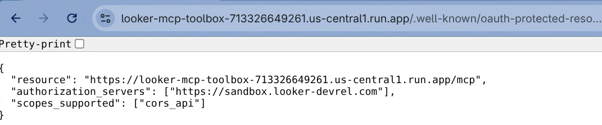
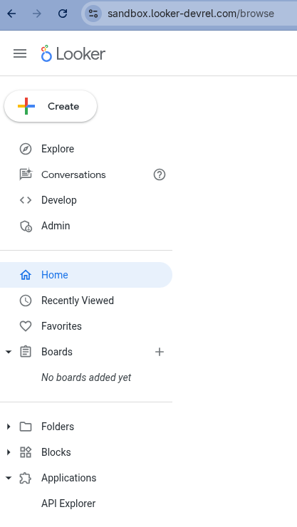
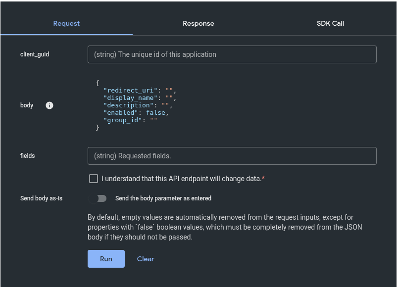
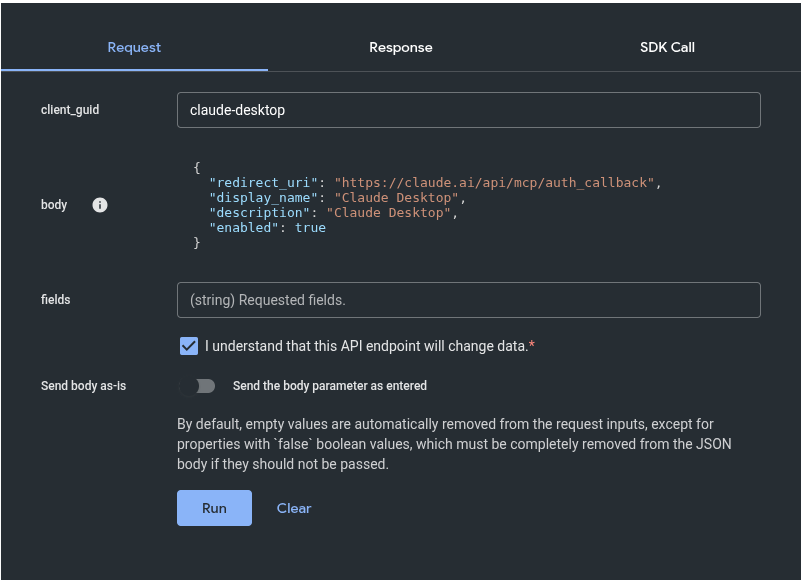
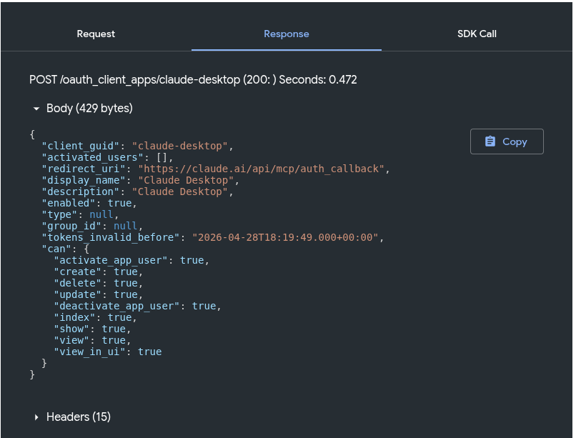
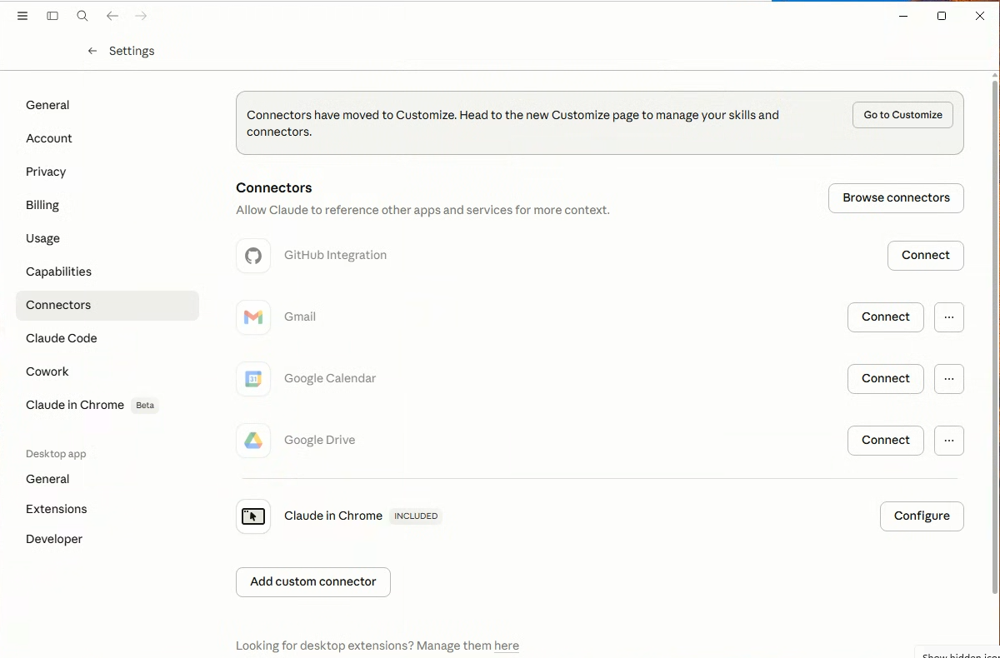
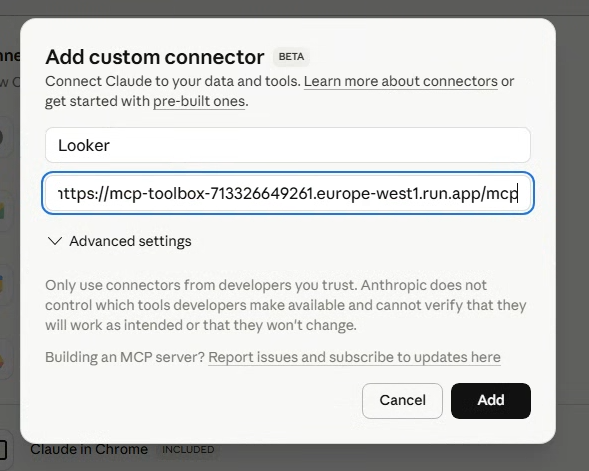
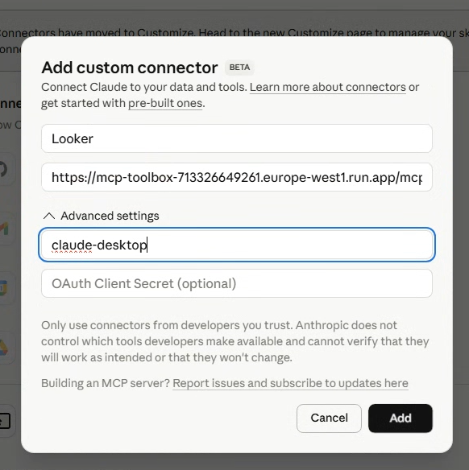
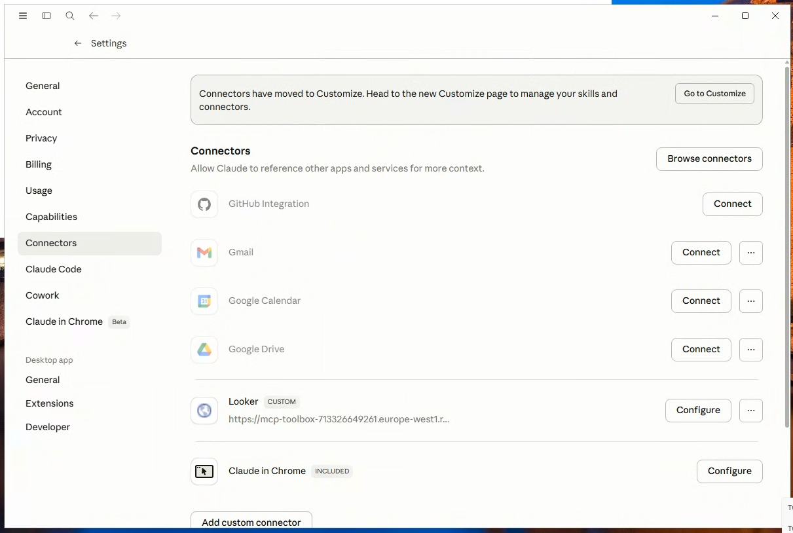

## Overview
In order for OAuth to work for an MCP client, the client needs to know how to
contact Looker, initiate the OAuth PKCE flow, and get a valid token. That
token can then be used in the Authorization header in requests to MCP Toolbox.
MCP Toolbox will then use that token when sending API requests to Looker.

Claude Desktop does not support as many configuration options as Gemini CLI,
so the methods for setting up Gemini CLI will not work. Instead, a new feature
was needed in MCP Toolbox.

One of the ways that a server can communicate its OAuth requirements is by
providing a document called “OAuth Protected Resource Metadata” (PRM) defined
by RFC 9728\. A server that supports PRM will respond to a HTTP GET request from
the client to the location `/.well-known/oauth-protected-resource` with a json
document that specifies the authorization servers to be used and the scopes that
are required for the OAuth authorization. The client can then start the OAuth
flow.

MCP Toolbox recently added support for specifying a PRM file and will serve that
GET request. This is needed to make OAuth from Claude Desktop work properly.

## Configure and Deploy MCP Toolbox
For an MCP Server to work with Claude Desktop, it must be accessed via HTTPS.
The MCP Toolbox in server mode only supports HTTP. Therefore it must be deployed
with a “reverse proxy” of some sort that receives the HTTPS messages, terminates
the SSL, then forwards the message as HTTP. Responses are sent via HTTP to the
proxy and are then sent to the client via HTTPS. This is a common pattern in the
networking world and should not be difficult to set up. Google Cloud Run, for
example, does this automatically.

1.  The toolbox should be run with the following environment variables set.
    `https://looker.example.com` should be substituted with the URL of your Looker
    server.

    * `LOOKER_BASE_URL=https://looker.example.com`  
    * `LOOKER_USE_CLIENT_OAUTH=true`

1.  The toolbox should be run with the following command line options:

    * `--prebuilt=looker,looker-dev`  
    * `--mcp-prm-file=prm.json`
    
    The `--mcp-prm-file=` setting is used to point to a json file with the settings
    that should be used for this case. The file should look like this:
    ```json
    {
      "resource": "https://looker-mcp-toolbox.example.com/mcp",
      "authorization_servers": ["https://looker.example.com"],
      "scopes_supported": ["cors_api"]
    }
    ```

    The “resource” field will be the URL of the reverse proxy server with `/mcp`
    added to the end. The “authorization\_servers” field will be an array with one
    element, the Looker URL, the same value as `LOOKER_BASE_URL` above. The
    “scopes\_supported” will also be an array with one element. That element is
    always “cors\_api”.

1.  Additionally, depending how the reverse proxy is set up, the following options
    might be useful:

    * `--address=0.0.0.0`  
    * `--port=8080`

    MCP Toolbox normally listens on 127.0.0.1 port 5000\. If the reverse proxy is on
    another host, you will need to use `--address=0.0.0.0` to indicate that it
    should bind to all ip addresses. The `--port=` setting is used if you need to
    use a listening port other than 5000\. Google Cloud Run, for example,
    automatically forwards external traffic from port 443, the HTTPS port, to 8080\.

1.  Deploy the toolbox and check that navigating to the proxy server url with the
    path `/.well-known/oauth-protected-resource`. You should see the contents of
    your PRM file in the browser.

    

## Register the OAuth App in Looker
1.  In Looker, go to “Applications” at the bottom of the list on the left side and
    then select the “API Explorer”.  

    

1.  On the left hand side, expand the “Auth” heading and choose “Register OAuth
    App”. Choose “Run It” from the top right. You will see this screen.  

    

1.  For client_guid, enter the string `claude-desktop`. 

1.  For the body, enter the following text:
    ```json
    {
      "redirect_uri": "https://claude.ai/api/mcp/auth_callback",
      "display_name": "Claude Desktop",
      "description": "Claude Desktop",
      "enabled": true
    }
    ```

1.  Check the box next to “I understand that this API endpoint will change data.”
    You should see this:  
    
    

1.  Now click the run button. Your response will look like this:

    

## Configuring Claude Desktop
1.  In Claude Desktop, go to Settings, then Connectors. You should see a page like
    this:  

    

1.  Choose “Add custom connector”. Enter a name like “Looker”. For the URL use the
    URL of the reverse proxy server with the path `/mcp` added to it.  

    

1.  Open “Advanced settings”. Enter `claude-desktop` as the OAuth Client Id. This is
    the client\_guid we registered in Looker. Leave the OAuth Client Secret blank.  

    

1.  Now click “Add”. Looker will show up under the list of connectors.

    

When you connect to Looker, Claude Desktop will initiate the PKCE Authentication
flow with Looker in your browser.
