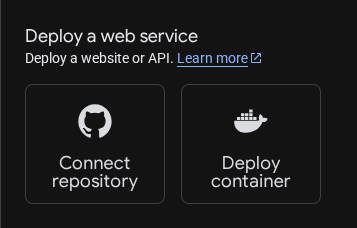
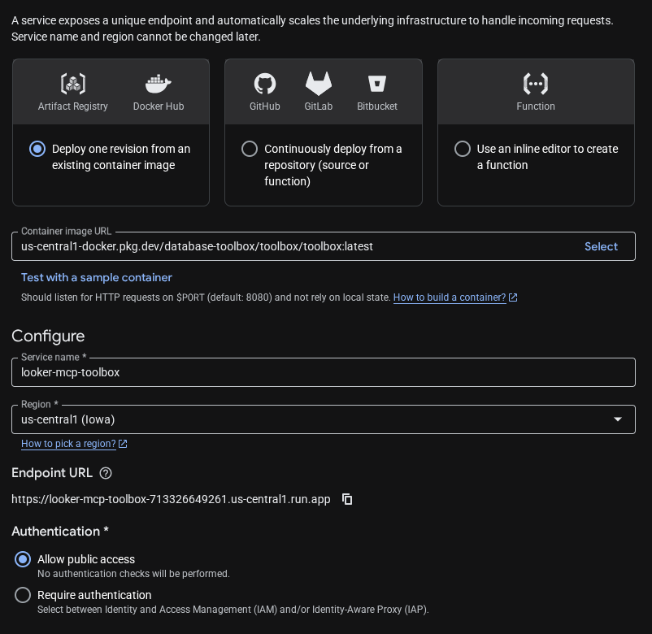
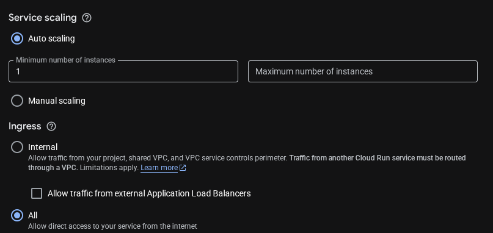
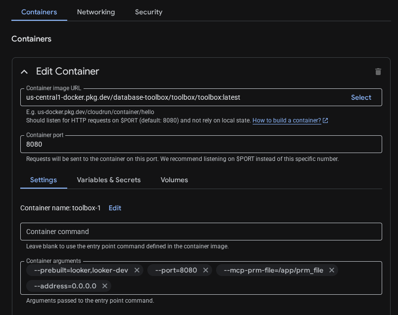
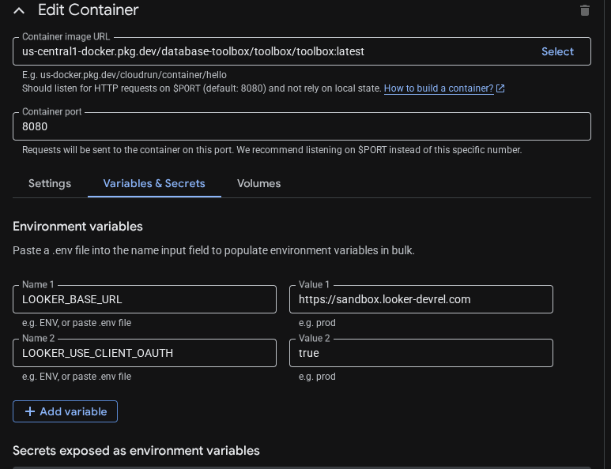
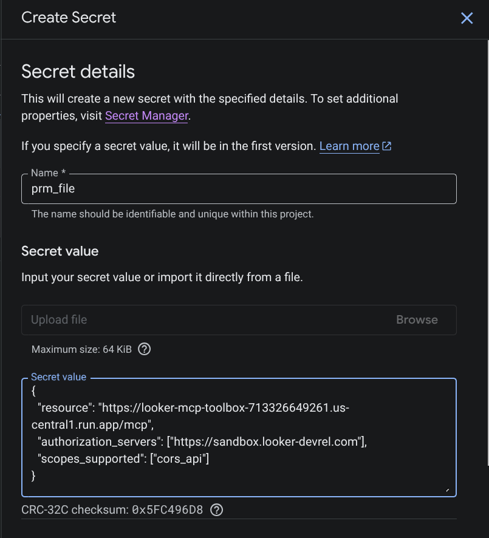
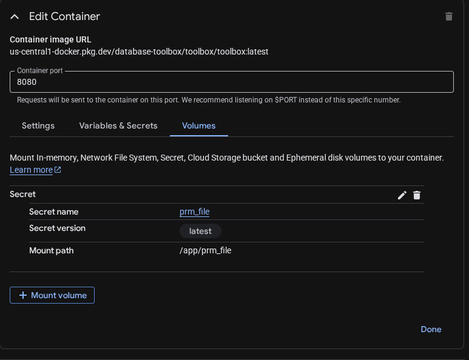

## Running MCP Toolbox in Google Cloud Run

It is easy to run MCP Toolbox in Google Cloud Run.

1.  Navigate to Cloud Run Overview in a Google Cloud Console project. Choose “Deploy container”:  

    

1.  Set the “Image name” to
    `us-central1-docker.pkg.dev/database-toolbox/toolbox/toolbox:latest`. Set
    the “Service name” to `looker-mcp-toolbox` and choose the “Region”. Note the
    “Endpoint URL”, you will need it later. Set the “Authentication” to “Public”.  

    

1.  Set “Service scaling” to Auto with a minimum number of instances of “1”. Set
    “Ingress” to “All”.
    
    

1.  Now open the drop down for “Containers, Networking, Security”.

1.  Under “Container settings” set “Container arguments” to
    `--prebuilt=looker,looker-dev`, `--port=8080`, `--address=0.0.0.0`, and
    `--mcp-prm-file=/app/prm_file`.  

    

1.  Under “Variables & Secrets” set `LOOKER_BASE_URL`, setting it to the URL of
    your Looker server, and `LOOKER_USE_CLIENT_OAUTH=true`.
    
    

1.  Under “Container Volumes” mount a new Secret Volume with a mount path of
    `/app`. Create a new secret `prm_file` with the contents of the PRM, for
    example:

    ```json
    {
    "resource": "https://<your-cloud-run-url>/mcp",
    "authorization_servers": ["https://<your-looker-instance>.looker.com"],
    "scopes_supported": ["cors_api"]
    }
    ```

    

    

1.  You may also need to go to IAM and grant the role “Secret Manager Secret
    Accessor” to your compute service account identity.

1.  Now click “Done” in the lower right corner. Then click Create to start the
    service.

1.  Validate the service is running by going to the URL, followed by
    `/.well-known/oauth-protected-resource`.

## Using the MCP Toolbox Via OAuth and Gemini CLI

1.  Follow the directions to register the [OAuth App in Looker](../looker_gemini_oauth/)

1.  In `$HOME/.gemini/settings.json` add the following stanza, using the Endpoint URL
    you saved earlier with `/mcp` appended.

    ```json
    "mcpServers": {
        "looker": {
            "httpUrl": "https://<your-cloud-run-url>/mcp",
            "oauth": {
                "clientId": "gemini-cli",
                "redirectUri": "http://localhost:7777/oauth/callback"
            }
        }
    },
    ```
1.  Start Gemini CLI and issue the command `/mcp auth looker`. Gemini CLI will start
    the OAuth flow. Approve access in the browser.

1.  Validate that everything works by issuing a prompt in Gemini CLI like "What Looker
    models do I have access to?"